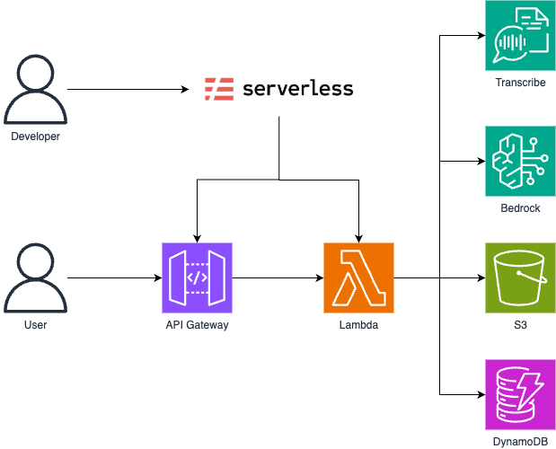

# AI Voice Assistance

## Overview

AI Voice Assistance is a project designed to help users improve their English language skills through interactive voice-based exercises. Leveraging advanced AI technologies, this application provides near real-time feedback on pronunciation, vocabulary, and grammar, facilitating an engaging and effective language learning experience.

## Features

- **Interactive Voice Exercises**: Engage in spoken exercises that cover various aspects of English language learning.
- **Near Real-Time Feedback**: Receive in few seconds assessments on pronunciation, vocabulary usage, and grammatical accuracy.
- **AI Analyze**: AI will analyze your vocabulary, providing powerful insights to improve your English.

## Architecture:



## Estimated Costs:

- Amazon S3 | 1 GB storage, 5K PUT/GET | ~$0,14
- Amazon Transcribe | 10 hours/month | ~$0,24
- Amazon Bedrock (Nova Micro) | 500K input/output tokens | ~$0,09
- Amazon Polly (Generative) | 10 hours of audio | ~$0,00
- Lambda (1M requests + 5000 ms + 128 MB) | ~$3.00
- API Gateway | 1M calls/month | ~$3.50

[💡 Total Estimated Monthly Cost: ~$9,56](https://calculator.aws/#/estimate?id=b2c5d8ad202d2a697977cf9d0c45b8a6dda13813)

## Prerequisites

Before setting up the project, ensure you have the following installed:

- **Python 3.x**
- **Pip**
- **Serverless Framework**
- **Node.js 22.x**

## Project Structure

```
ai-voice-assistance/
├── src/ # Source code
├── static/ # Static files (e.g., HTML front-end file)
├── .env.example # Example environment config
├── .gitignore # Git ignore rules
├── README.md # Project documentation
├── deploy-example.sh # Example deployment script
├── serverless.yml # Serverless Framework config
```

## Contributing

We welcome contributions to enhance the AI Voice Assistance project. To contribute:

1. Fork the Repository

2. Create a New Branch with a descriptive name

3. Make Your Changes

4. Submit a Pull Request with a clear description

Please ensure your contributions align with the project's coding standards and include appropriate documentation and tests.

## License

This project is licensed under the MIT License. You are free to use, modify, and distribute this software in accordance with the terms of the license.

## Acknowledgments

Thanks to all contributors and the open-source community for their support and resources that have made this project possible.
